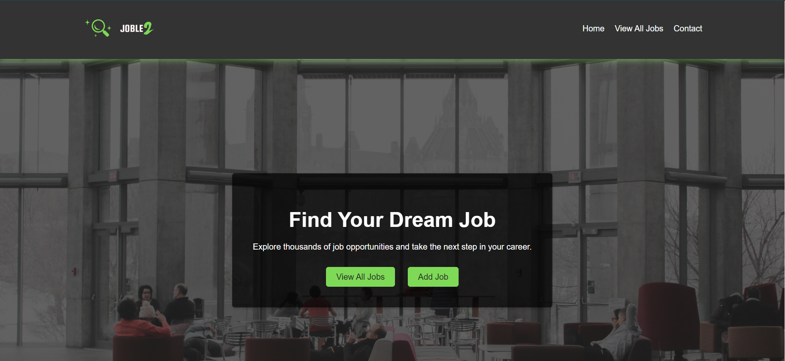
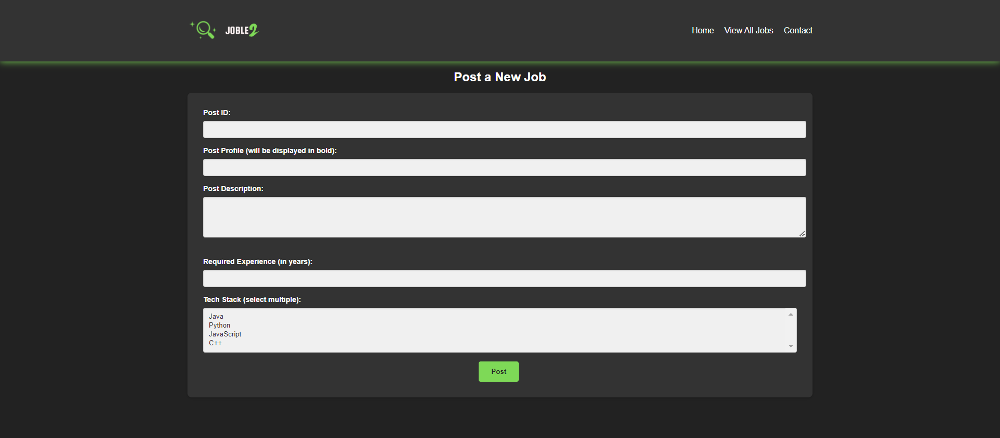
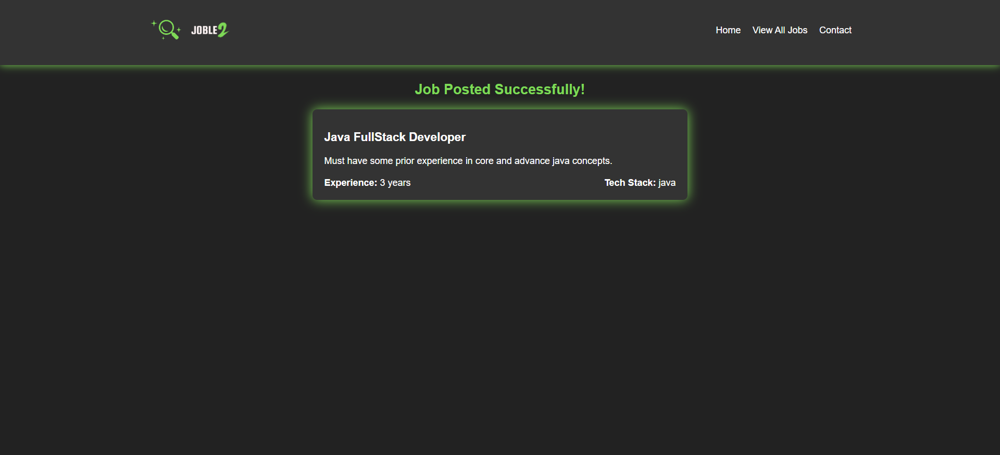

# JobLe2 - My Job Portal Learning Project (React Edition)

<div align="center">
  <a href="https://github.com/YOUR_USERNAME/YOUR_REPOSITORY_NAME">
    
  </a>
</div>

This is a revamped version of my JobLe2 project, now built using React.js for the frontend and Java Spring Boot for the backend. It's still a learning project focused on building a basic job portal where users can post and view job listings.

## Features

* User-friendly interface (improved with React components!)
* Basic job posting and viewing functionality
* Dark theme for a cool look

## Screenshots

* Home Page

<div align="center">
  
</div>

* Job Posting Form

<div align="center">
  
</div>

* Job Listings Page

<div align="center">
  
</div>

* Success Page

<div align="center">
  
</div>

## Technologies Used

* **Frontend:**
    * React.js
    * HTML
    * CSS
* **Backend:**
    * Java
    * Spring Boot

## Getting Started

### Prerequisites

* **Node.js and npm:** Make sure you have Node.js and npm (Node Package Manager) installed. You can download them from the [official Node.js website](https://nodejs.org/).
* **Java JDK 17 or above:** You'll also need a compatible Java Development Kit.

### Running the Application

#### 1. Frontend (React)

1. **Navigate to the frontend directory** (it's named `frontend`):
   ```bash
   cd frontend

2. **Install dependencies:**
   ```bash
   npm install

3. **Start the development server:**

   ```bash
   npm start

#### 2. Backend (Spring Boot)
If you're using IntelliJ IDEA or Eclipse:

  1.  **Open the project in your IDE:**
  *   IntelliJ IDEA: `File -> Open` and select the cloned project folder.
  *   Eclipse: `File -> Import -> Existing Maven Projects` and select the cloned project folder.

  2.  **Run the application:**
  *   Locate the `O205JobLe2RestReactApplication.java` file.
  *   Right-click on it and choose "Run 'App.java'" or a similar option.

  3.  **Access the application:**
  *   Once the application starts, open your web browser and go to `http://localhost:8080`.

#### 2. Using Maven (For VS Code or Command Line)

If you prefer using VS Code or the command line, you'll need Maven installed:

1. **Install Maven:**
  * Download and install Maven from the [official Apache Maven website](https://maven.apache.org/download.cgi).
  * Make sure the `mvn` command is available in your terminal or command prompt.

2. **Navigate to the project directory:**
*  ``` Bash
       cd O14RestSpringBoot/)205JobLe2RESTReact

3. **Build and run the application:**
*  ```bash
      ./mvnw spring-boot:run 

4. **Access the application:**
*   Once the application starts, open your web browser and go to `http://localhost:8080`.

### Running the Application
Feel free to contribute if you have any ideas or improvements!

### License
This project is licensed under the MIT License.

## Thank You

<div align="center">
  
</div>

Thank you for checking out my JobLe2 project! I hope this learning journey with Java, Spring Boot, and React has been as insightful for you as it has been for me.

If you have any questions, suggestions, or just want to connect, feel free to reach out. Let's keep brewing awesome code together! ☕